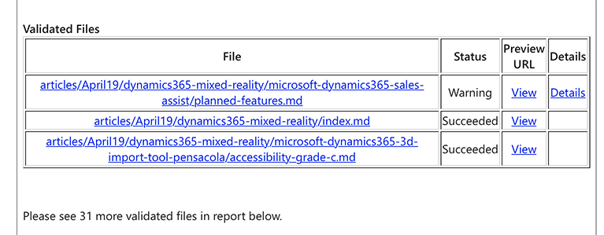
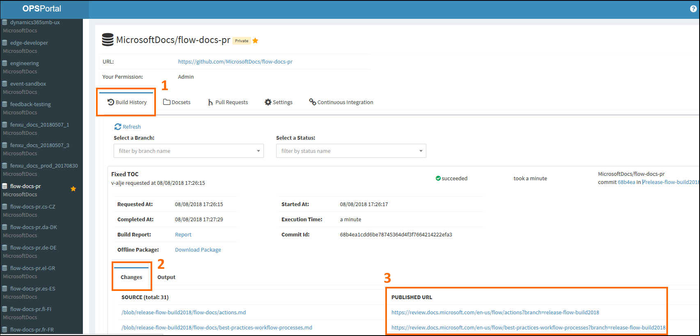

# Review links

There are multiple methods for finding, or creating, review links for content in your branches.

## Finding review links

### OPS build email

Each time you commit a change, the build system ("OPS") generates a build. When that build completes (or fails), the OPS system sends a status email message. The subject line for these messages will be similar to **[Succeeded With Warning] Open Publishing Build Service - Publish**. The text in the brackets can be "Succeeded", "Succeeded With Warning", or "Failed". These messages contain review links for pages that were successfully built.

 > [!div class="mx-imgBorder"]
 > 

Click **View** to navigate to a review build of a particular page. To find links for all topics included in a build, click **Open Publishing Publish Report** near the end of the build status email.

If you aren't receiving build status emails, check your GitHub notification settings.

 1. Navigate to <https://github.com/settings/notifications>. You may need to log     in to GitHub.

 2. Under **Email notification perferences**, verify the email address in     **Default notification email**, and make sure **Include your own updates**  is checked.

Also check your Outlook rules to make sure the messages aren't being blocked.

### OPS build portal

The OPS build portal gives an overview of OPS builds. To see the status of your build, and access review links:

 1. Navigate to [http://ops](http://ops) and sign in.

 2. Find your repo by either scrolling in the left pane, or using the search box. Select it.

 > [!NOTE]
 > To make it easier to find your report in the future, you can either click the star icon to add a particular repo to your list of favorites, or bookmark the page URL.

 3. Depending on the type of report, you may need to click either the **Build History** or **Builds** tab.

 4. Scroll down to find the build for your commit.

 5. Once the build is completed, click to expand.

 6. Scroll down for review links. You can also click **Report** to see the build report.

 > [!div class="mx-imgBorder"]
 > 

## Navigating the review site

Most of the time, you can use your browser to navigate to your review content.

 1. Navigate to a live topic in your docset (if possible, find the topic you'd like to review). For example [https://docs.microsoft.com/en-us/business-applications-release-notes/October18/index](https://docs.microsoft.com/en-us/business-applications-release-notes/October18/index).

 2. Prepend **review** to the topic URL. For example [https://**review**.docs.microsoft.com/en-us/business-applications-release-notes/October18/index](https://review.docs.microsoft.com/en-us/business-applications-release-notes/October18/index).

 3. Use the branch dropdown to select your branch.

 >[!div class="mx-imgBorder"]
 >

 > [!NOTE]
 > You can also edit the URL. Set the **branch=** parameter to your branch name.

 4.  If necessary, use the TOC to navigate to your topic.

## Creating review links

You can also create review links.

 > [!NOTE]
 > It can be helpful to bookmark a review link or two for future reference.
