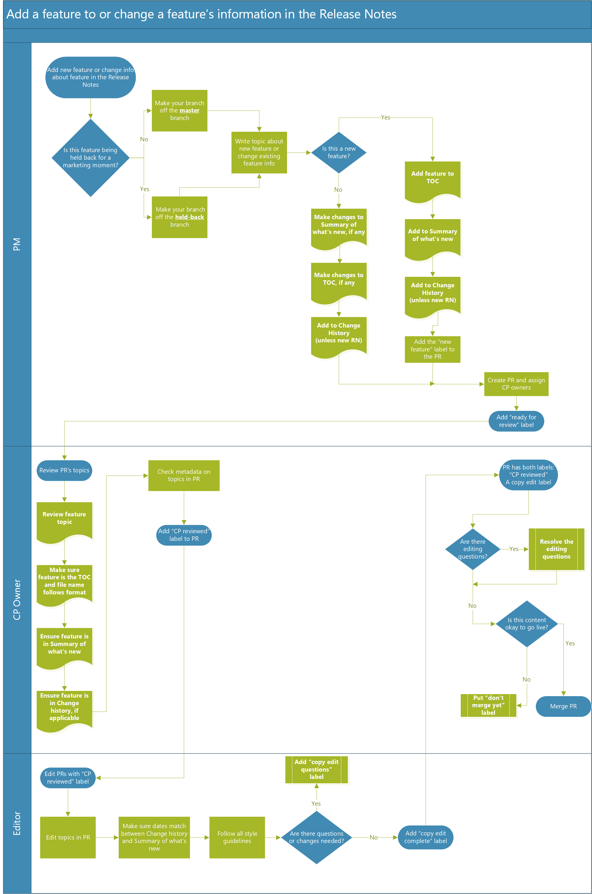

# Authoring process

Our wave 2 content is created and updated in the Release Planner tool and edited on GitHub. April '19 release notes are created, updated, and edited in GitHub. You'll need to be familiar with both.

To create or update release plans, you should work in the [Release Planner tool](https://aka.ms/bagreleasenotes). 

For guidance on using the tool, see these resources (available under Resources in the left navigation pane of the tool):
- [BAG Release Planner App Guide](https://microsoft.sharepoint.com/:w:/t/ProjectBahnhof/EYBGZgE9Js5CioBE2LAIjSwBCgn_hvM9QtZ7gPimS85vkQ?rtime=RWW9laMl10g) 
- [Demo video](https://msit.microsoftstream.com/video/c78b4dec-e4c3-4cd9-b827-c6535c11757a?list=studio)

To create a GitHub account and join our org, read the [Contributors Guide](contributors-guide.md), in particular [Get started](get-started.md) and [Work directly in our repos](work-repos.md).

For **PMs** still working on April '19 content: A best practice is to create your own branch off of the working branch, and then make all your changes to it for the feature or features you are working on. For example, if you update the description and target release date for a feature, you would create one branch and then make your changes to the feature's topic, the summary of what’s new topic, and change history topic all as part of one pull request (PR). 

**Editors** will review pull requests in GitHub. If they have questions about the content, they'll contact the PM in email. Otherwise, they'll approve and merge the pull requests. 

**Warning:** Once you merge a PR into master, it can go live at any time. Never merge into master until you are sure the information about the feature is ready to be public knowledge. 

<!--this needs updating:

 
 -->

