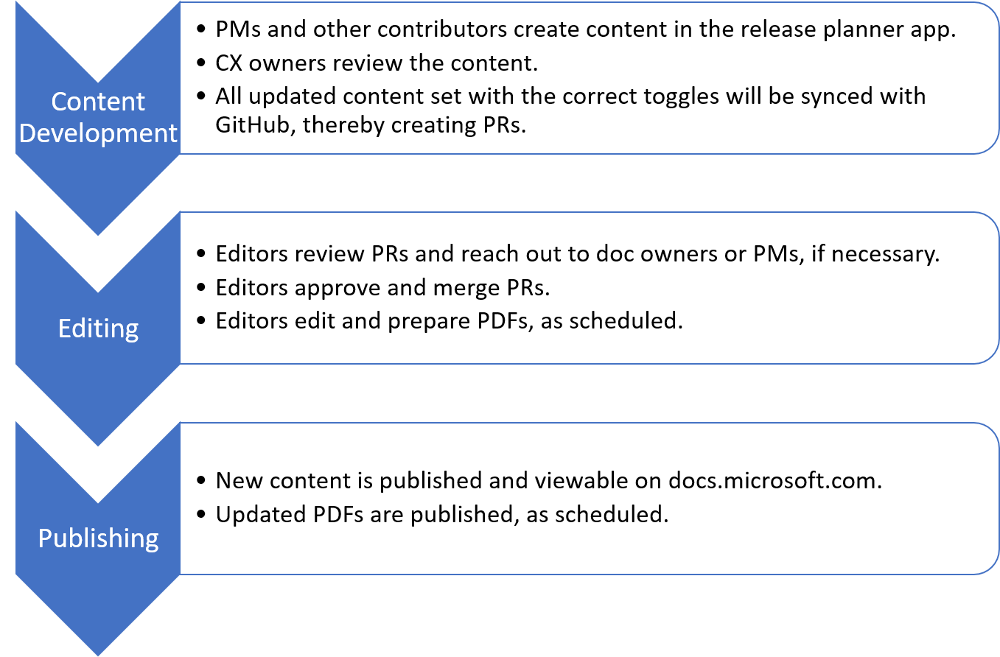

# Release plans overview

This guide provides information on how CX owners, contributors, PMs, editors, and other team members can add to our official release plans content on [docs.microsoft.com](https://docs.microsoft.com/business-applications-release-notes/). This guide provides specific information about release plans from content development to publishing. 

> [!NOTE]
> Since this guide is specific to **Release plans**, there will be differences from the [Contributors' Guide for Docs](contributors-guide.md). In instances of conflict, this guide wins.

## Current release plans

These release plans and PDFs are current and updated regularly.

- **[Dynamics 365: 2021 release wave 1 plan](https://docs.microsoft.com/dynamics365-release-plan/2021wave1/)**
- **[Microsoft Power Platform: 2021 release wave 1 plan](https://docs.microsoft.com/power-platform-release-plan/2021wave1/)** 

<!--With the **2020 release wave 1 plans**, we implemented to following changes: 
- All release plans release prior to 2019 release wave 2 will no longer be updated.
- **Info about ADO system for updates during publish will be added.**
- Questions about publishing can be sent to the email alias [BAG Release Plans Publishing](mailto:rppub@microsoft.com).-->

<!--| Feature | Notes | PDF |
| -- | -- | -- |
| **[Dynamics 365: 2021 release wave 1 plan](https://docs.microsoft.com/dynamics365-release-plan/2021wave1/)** | Updated regularly. | Updated regularly. |
| **[Microsoft Power Platform: 2021 release wave 1 plan](https://docs.microsoft.com/power-platform-release-plan/2021wave1/)** | Updated regularly. | Updated regularly. |-->

## Archived release plans

These release plans and PDFs are archived and will no longer be updated.

- **[Dynamics 365: 2020 release wave 2 plan](https://docs.microsoft.com/dynamics365-release-plan/2020wave2/)**
- **[Microsoft Power Platform: 2020 release wave 2 plan](https://docs.microsoft.com/power-platform-release-plan/2020wave2/)**
- **[Dynamics 365: 2020 release wave 1 plan](https://docs.microsoft.com/dynamics365-release-plan/2020wave1/index)**
- **[Microsoft Power Platform: 2020 release wave 1 plan](https://docs.microsoft.com/en-us/power-platform-release-plan/2020wave1/)**
- **[Dynamics 365: 2019 release wave 2 plan](https://docs.microsoft.com/dynamics365-release-plan/2019wave2/)**
- **[Power Platform: 2019 release wave 2 plan](https://docs.microsoft.com/power-platform-release-plan/2019wave2/)**
- **[April '19 release notes](https://docs.microsoft.com/business-applications-release-notes/April19/index)**
- **[October '18 release notes](https://docs.microsoft.com/business-applications-release-notes/October18/index)**
- **[April '18 release notes](https://docs.microsoft.com/en-us/business-applications-release-notes/April18/index)** 

<!--With the **2019 release wave 2 plans**, we implemented the following changes:
- Changed the name to "release plans" from "release notes."
- Moved to new repos in GitHub.
- Split the content into two parts: Dynamics 365 and Power Platform. This includes publishing two separate PDFs.  
- Introduced the Release Planner app. PMs use this to input their feature information for the release plans. The information is pushed into GitHub and used for the BAG product roadmap. All content is created and updated int he release planner app.-->

<!--| Feature | Notes | PDF |
| -- | -- | -- |
| **[Dynamics 365: 2019 release wave 2 plan](https://docs.microsoft.com/dynamics365-release-plan/2019wave2/)** | This release plan is archived, and will no longer be updated. | No longer updated. |
| **[Power Platform: 2019 release wave 2 plan](https://docs.microsoft.com/power-platform-release-plan/2019wave2/)** | This release plan is archived, and will no longer be updated. | No longer updated.|
| **[April '19 release notes](https://docs.microsoft.com/business-applications-release-notes/April19/index)** | This release plan is archived, and will no longer be updated. | No longer updated. |
| **[October '18 release notes](https://docs.microsoft.com/business-applications-release-notes/October18/index)** | This release plan is archived, and will no longer be updated. | No longer updated. |
| **[April '18 release notes](https://docs.microsoft.com/business-applications-release-notes/April18/index)** | This release plan is archived, and will no longer be updated. | No longer updated. | -->

## Release plan fields

| Field | Description | Audience |
| ----- | ----- | -----|
| [Product overview](product-overview.md) | A top-level description of each product that showcases the best parts of a product and new features | Business decision makers, Technical roles |
| [L2 overview](L2-overview.md) | A top-level description of each subgroup within a main product | Business decision makers |
| [Feature name](feature-name.md) | Showcases the core aspects of a feature quickly, clearly, and concisely | Business decision makers, Technical roles |
| [Metadata](metadata.md) | "Hidden" content that helps users find topics through search engines | Business decision makers, Technical roles |
| [Business value](business-value.md) | Outlines the benefits and added values that each product offers to its customers | Business decision makers |
| [Feature detail](feature-detail.md) | A description of the technical aspects of a feature, focusing on the most important details | Business decision makers, Technical roles | 

## Release plans workflow

There are many working parts to publishing release plans to docs.microsoft.com. It is important to know how each step and role impact the overall process. The graphic below shows each step of the process:  

The content is created in the release planner app, and a flow pushes the content to GitHub as pull requests (PRs). The flow pushes edited content back into the release app. This is called the "reverse sync" as shown in the graphic below:  

