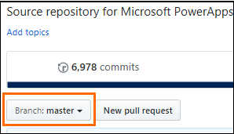
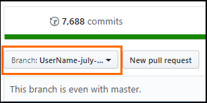
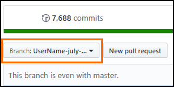
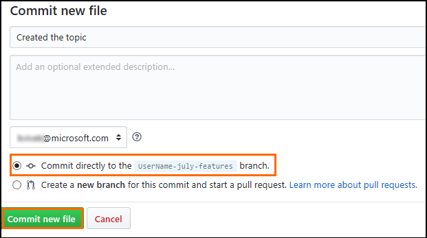
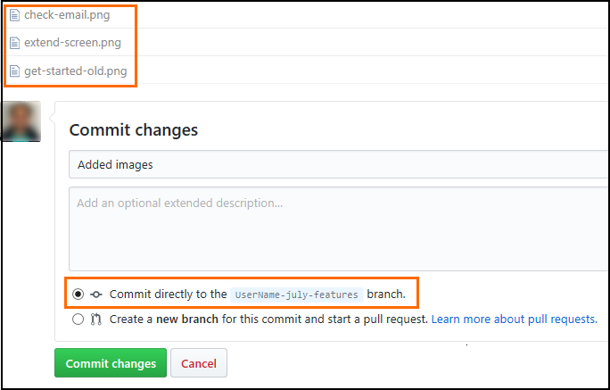

# Use browser to contribute

## Making quick edits to a topic

1.  Identify the topic that you want to edit. For example:
    <https://docs.microsoft.com/en-us/powerapps/maker/index>

2.  Add **review** before **docs** in the URL to ensure that you are making
    changes to the internal (private) docs repo. For example, change the above
    URL to <https://review.docs.microsoft.com/en-us/powerapps/maker/index>

3.  Select **Edit** in the top-right corner of the topic to edit.  
    

    

4.  If you are not already signed in to your GitHub account, you will be
    prompted to sign in. After providing the GitHub credentials, and signing in,
    you will be taken to the source topic on GitHub.

5.  Select the pencil icon on GitHub to edit the topic:  
    

    

6.  After making the required changes, scroll to the bottom of the page, type a
    title and description for your changes, *select to create a new branch*, and
    click **Propose file change**.     

    

7.  Next, create a pull request from
    your newly created branch to the **master** branch.

8.  A writer will pick up your PR, merge it into the master branch, and publish live. After merging your PR, the writer will delete your branch to avoid branch clutter in our repo.

> [!NOTE]
> Any **stale** branches (branches with no active pull requests and no activity for 8 weeks) will be deleted from our repo. If you have a special situation, please contact [crmce](mailto:crmce@microsoft.com).

## Making multiple changes in your branch

If you want to make changes in multiple files and are aware of the file location
in [our GitHub repo](get-started.md#our-repos), you must *start
with creating a branch* in the repo, make all your changes, and then create a
pull request to merge all the changes your branch.

## Create a branch

You must always create a branch to work on your changes.

1.  Browse to one of [our GitHub repos](get-started.md#our-repos).

2.  Ensure that you are on the **master** branch; if not, select the **master**
    branch.  
    

    

3.  Select the branch list, type a unique name for your branch, and press ENTER
    or select **Create branch**. You can have your Microsoft alias followed by
    the feature or work that you will be doing as your branch name so that it’s
    easier for you (and others) to identify the branch.  
    

    

### Update multiple files

1.  Browse to one of [our GitHub repos](get-started.md#our-repos).

2.  Ensure that your branch is selected in the branch list before working on
    your changes. If you don’t already have a branch, first create a branch.  
    

    

3.  Browse to the file that you want to change, and select the pencil icon to
    edit the topic:  
    

    

4.  After changing the file, commit *directly* to your branch.  
    

    

5.  Browse to another file, make changes, and commit to your branch. Repeat
    until you are done with your changes.

    Every time you commit a change, the files will be built, and you will get a
review link on docs in your email with your recent changes that you can review.

6. When your changes are ready to be published live, create a pull request as described later in this topic.

## Create a file

1.  Browse to one of [our GitHub repos](get-started.md#our-repos).

2.  Ensure that your branch is selected in the branch list before working on
    your changes. If you don’t already have a branch, first [create a branch](#create-a-branch).  
    

    

3.  Browse to the folder/location where you want to create a file, and then
    select **Create new file**.  
    

    

4.  Specify a name for your file, and press ENTER. For example,
    my-first-file.md.  
    

    

5.  Make changes in your file, and then commit directly in your branch to create
    the file.  
    

    

6.  When your changes are ready to publish live, create a pull request as described
    later in this topic.

### Upload images

1.  Browse to one of [our GitHub repos](get-started.md#our-repos).

2.  Ensure that your branch is selected in the branch list before working on
    your changes. If you don’t already have a branch, first [create a branch](#create-a-branch).  
    

    

3.  Capture/create your screen shot, and save it as a .png file on your
    computer. No spaces in the file names; use hyphens and all lowercase letters. For example: **work-with-views.png**.

4.  Navigate to the **media** folder under the topic folder where you want to
    add the image.

5.  Select **Upload files**, and then select **choose your files**.  
    

    

6.  Browse on your computer to select the image file. You can select multiple
    files, if required.

7.  After selecting the required image files, commit the changes directly to
    your branch.  
    

    

8.  When your changes are ready to publish live, create a pull request as described
    later in this document.

## Rename a file

> [!CAUTION]
> Renaming a file will lead to broken links. Also, if the file is
aready published live, a redirect must be set to route from the original URL to the new URL. Please work with your CPub contact before renaming a file to understand the implications.

1.  Browse to one of [our GitHub repos](get-started.md#our-repos)

2.  Ensure that your branch is selected in the branch list before working on
    your changes. If you don’t already have a branch, first [create a branch](#create-a-branch).      

    

3.  Browse to the file that you want to rename, and select the pencil icon to
    edit the topic:  
    

    

4.  Instead of editing the contents, change the file name at the top:  
    

    

5.  Commit the change directly to your branch.

6.  When your changes are ready to ship, create a pull request as described
    later in this document.

### Delete a file

1.  Browse to one of our GitHub repos. See here: [Reference: our
    repos](#_Reference:_our_repos_1)

2.  Ensure that your branch is selected in the branch list before working on
    your changes. If you don’t already have a branch, first create a branch.  
    

    

3.  Browse to the file that you want to delete, and select the delete icon:  
    

    

4.  Commit directly in your branch to delete the file.

5.  When your changes are ready to ship, create a pull request as described
    later in this topic.

### Finally: Create pull request to merge your changes and publish live

1.  Browse to one of our GitHub repos. See here: [Reference: our
    repos](#_Reference:_our_repos_1)

2.  Ensure that your branch is selected in the branch list. Select **New pull
    request**.  
    

    

3.  Ensure that the **master** branch is on the left and your branch on the
    right before you create a pull request. Type a pull request title and select
    **Create pull request**.  
    

    

At this point, you are done. A feature writer will pick up the pull request
within next day or so, and merge it to master, and publish live.